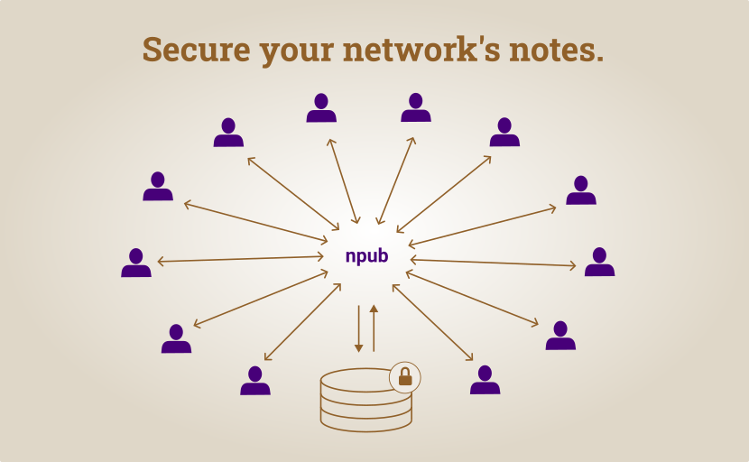

# strfry-tools

A set of tools for [strfry](https://github.com/hoytech/strfry) relays for the [Nostr protocol](https://github.com/nostr-protocol/nips).



Included programs and plugins:
- `strfry-config` This will auto generate configs for a `stryfry router` and for `strfry-sync` based on user pubkeys for streaming and syncing a network of contacts.
- `strfry-sync` This will sync a network of contacts using `negentropy` with `strfry sync`.
- `strfry-router-plugin` This is a write policy plugin for `stryfry router` to only allow specific event authors.
- `strfry-write-plugin` This is a standalone write policy plugin for a `strfry relay`.

## StrFry Config

This program (`strfry-config`) creates configuration files based on a set of configured root pubkeys. Their `kind 3` (NIP-02) contact/follow lists and `kind 10002` (NIP-65) relay list metadata ("outbox model") are retrieved for syncing and streaming events for them and their contacts through their relays.

There are several output files:
- A config file for a `strfry router` to have user specific relay-to-relay topology, this also includes many config files for `strfry router` write policy plugins.
- A config for `strfry-sync` that uses `negentropy` to sync notes for complete and bandwidth efficient synchronization.

### Build & Install

```bash
make
cp strfry-config /usr/local/bin/strfry-config
cp strfry-router-plugin /usr/local/bin/strfry-router-plugin
```
### Configuration

Example configuration (`sample-router.yml`):
```yaml
log-level: "debug"

discovery-relays:
  - "wss://domain1.tld"
  - "wss://domian2.tld"

router-plugin-down: "/usr/bin/local/strfry-router-plugin"
router-plugin-config: "/var/local/strfry/router-plugin"
router-config: "/var/local/strfry/router.config"
sync-config: "/var/local/strfry/sync.json"
sync-strfry: "/usr/bin/local/strfry"
sync-strfry-log: "/var/local/strfry/logs/sync"
sync-status-file: "/var/local/strfry/sync-status.json"

users:
  - name: "alice"
    pubkey: "<32-byte-public-key-hex>"
    depth: 1
    relay-depth: 1
    dir: down
```

Main options:
- `log-level` defines the verbosity of logs. The options include from less verbose to most: "panic", "fatal", "error", "warn", "info", "debug" and "trace".
- `discovery-relays` are used to retrieve the `kind 10002` (NIP-65) relay list metadata for each pubkey that has been defined in `users`.
- `router-plugin-down` defines the location of the `strfry-router-plugin` executable for a `strfry router`.
- `router-plugin-config` defines the configuration base path for the `strfry router` plugin. It shouldn't include an extension as it is a base path to create multiple files.
- `router-config` is the location of the `strfry router` configuration.
- `sync-config` is the location of the `strfry-sync` configuration file.
- `sync-strfry` is the location of the `strfry` executable.
- `sync-strfry-log` is the location of the `strfry sync` command logs, it is a base filename.
- `sync-status-file` is the location that the sync status for each relay will be written.
- `users` defines the set of root pubkeys that will have their `kind 3` and `kind 10002` events used to define the router streams.

Other user options:
- `pubkey` is the hex encoding of a Nostr user's public key
- `dir` defines the direction of the stream. Values can be "down", "both" or "up".
- `depth` defines how deep the `kind 3` contact/follow list will be navigated (it is usually left as `1`).
- `relay-depth` option is the depth that relay list metadata is added to the config, it must be equal or less than the `depth`.

### Running

To run the program:
```bash
./strfry-config --conf="</path/to/config.yml>"
```

This will start a daemon process that will create the configuration files necessary to run a `strfry router`. Please see `strfry` [router documentation](https://github.com/hoytech/strfry/blob/master/docs/router.md) for further information about [installing](https://github.com/hoytech/strfry?tab=readme-ov-file#setup) and running the router. The `strfry router` will reload modifications to the config made from this daemon automatically. Similarly the config for the plugin will also met reloaded, thus changes can be made to the topology without restarting the processes.

## StrFry Sync

### Build & Install

```bash
make
cp strfry-sync /usr/local/bin/strfry-sync
```

This program uses the `strfry sync` command to synchronize a set of users defined in the configuration file. The file is auto generated by the command `strfry-config` based on user's pubkeys. As similar to the router, Their `kind 3` (NIP-02) contact/follow lists and `kind 10002` (NIP-65) relay list metadata ("outbox model") are retrieved for syncing.

### Running

To run the program:
```bash
./strfry-sync --conf="</path/to/config.json>"
```

## StrFry Router Plugin

### Build & Install

```
make
cp strfry-router-plugin /usr/local/bin/strfry-router-plugin
```

This plugin is used for the `strfry router` to allow events from specific authors based on a config file auto generated by `strfry-config`.

## StrFry Write Plugin

This is a standalone simple plugin for configuring the write policy of a `strfry relay`. This can be with our without running a `strfry router`.

### Build & Install

```bash
make
cp strfry-write-plugin /usr/local/bin/strfry-write-plugin
```

### Configuration

In your `strfry.conf` file, you can add this plugin by including it in the write policy configuration.

```conf
	writePolicy {
		plugin = "/usr/local/bin/strfry-writepolicy"
	}
```

To configure the policies, you can use environment variables or a configuration file at `/etc/strfry-writepolicy.yml`.

Example environment variables:
```conf
export STRFRY_AUTHOR_WHITELIST='<hex-pubkey>, <hex-pubkey>'
```

Example `/etc/strfry-writepolicy.yml` configuration file:
```yaml
author-whitelist:
  - "<32-byte-public-key-hex>"
  - "<32-byte-public-key-hex>"
```
